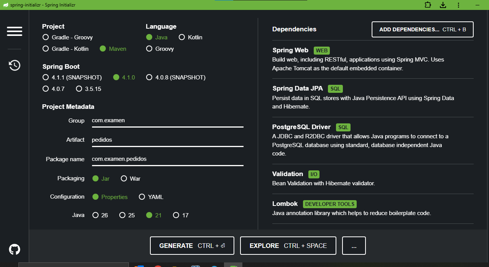
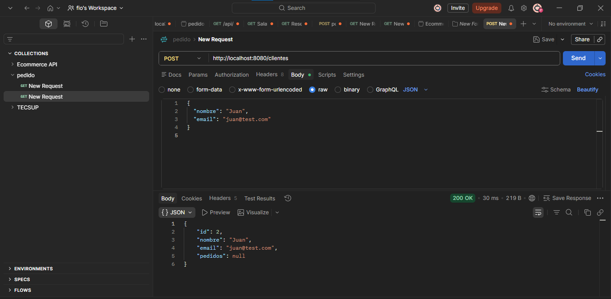
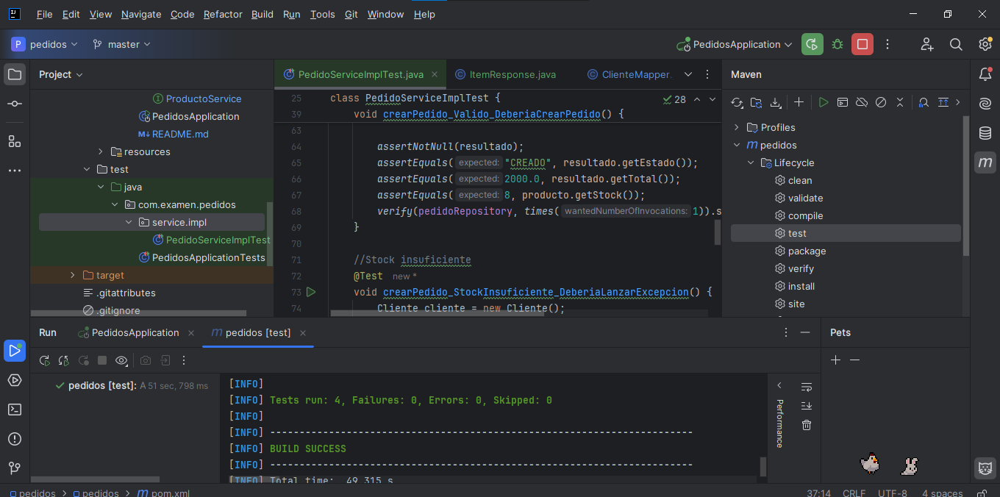

****API REST de Gestión de Pedidos****

Tecnologías usadas:
* Java 21
* Spring Boot
  (Spring Web, Spring Data JPA, PostgreSQL Driver, Lombok, Validation)
* Maven
* PostgreSQL
* JUnit 5 - Mockito
* Postman

Instrucciones para ejecutar:
* mvn clean install
* mvn spring-boot:run
* mvn test

Configuración de base de datos:
* CREATE DATABASE db_pedidos (PostgreSQL)
* configuración en application.properties
  (update: URL, usuario postgres, contraseña admin)
* mvn clean install (Maven)

Endpoints disponibles
* POST /api/clientes
* POST /api/productos
* POST /api/pedidos
* GET /api/pedidos/{id}
* GET /api/pedidos/cliente/{clienteId}

